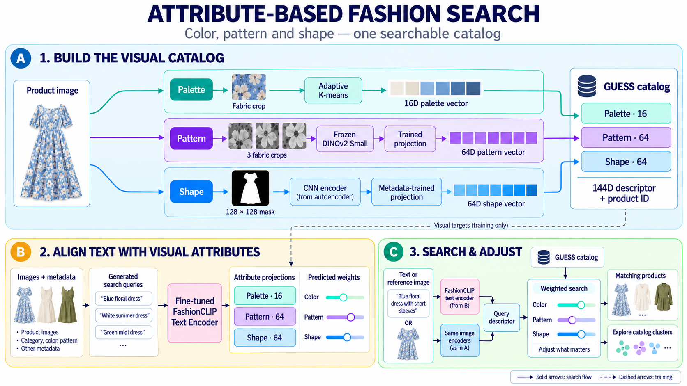

# GUESS Hackathon

A visual fashion search prototype built around a simple idea: people often know what they like when they see it, but catalog categories and keywords do not fully describe that preference. Let users search with a photo or a few words, then decide whether color, pattern or shape matters most.

## How it works

Each product image is described by three visual attributes: **color, pattern and shape**. A text query or reference photo is translated into the same representation, allowing the search engine to find related products in the GUESS catalog.

Users adjust three sliders to decide what matters most: keep a favorite pattern while exploring other colors, or focus on a similar silhouette. An interactive catalog map also helps customers and internal teams explore visual product families. Learning preferences from user feedback is a possible future extension.



## Run

Start Docker Desktop with Linux containers, then launch the prepared image:

```sh
docker run --rm --init -p 127.0.0.1:8767:8767 fashion-atlas
```

Open **http://localhost:8767**. Press Ctrl+C to stop. This command runs on CPU; add `--gpus all` to use an NVIDIA GPU supported by Docker.

Build the image once from the project folder (and rebuild after changes):

```sh
docker build -t fashion-atlas .
```

**Data required:** the GitHub repository contains code, not catalog photos or model weights. Before building, copy the prepared `data/`, `pretrained/`, `artifacts/` and `cache/images.npz` from the local project. No API key is needed. [Docker details](docs/docker.md).

## Files

- `fashion_atlas/` — server, models and search.
- `fashion_atlas/preprocessing/` — image, palette and silhouette processing.
- `fashion_atlas/training/` — preparation, training and evaluation.
- `web/` — interface and cluster maps.
- `docs/` — [development and training](docs/development.md).

Local launch: `python -m fashion_atlas` (after installing `requirements.txt`).

## Disclaimer

The original idea and product concept were developed by our team. Generative AI tools assisted with rapid coding, testing, prototyping and subsequent refinement, including documentation and visuals.
